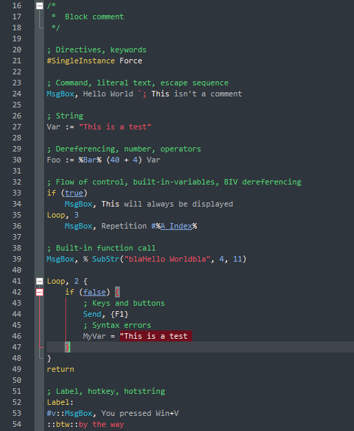

# Darchon
A [theme](https://autohotkey.com/boards/viewtopic.php?f=61&t=69) for [SciTE4AutoHotkey](http://fincs.ahk4.net/scite4ahk).

## Instructions
1. Download _**[Darchon.style.properties](https://raw.githubusercontent.com/ahkon/Darchon/master/Darchon.style.properties)**_ and place it in your user _**Styles**_ folder. (_**Styles**_ is typically located in `C:\Users\<USERNAME>\Documents\AutoHotkey\SciTE\Styles` or `..\SciTE\user\Styles` for portable installations.)
1. In SciTE4AutoHotkey, select _**Tool**s_ > _**SciTE4AutoHotkey Settings...**_
    1. Set _**Style**_ to _**Darchon**_.
    1. Click _**Update**_.
